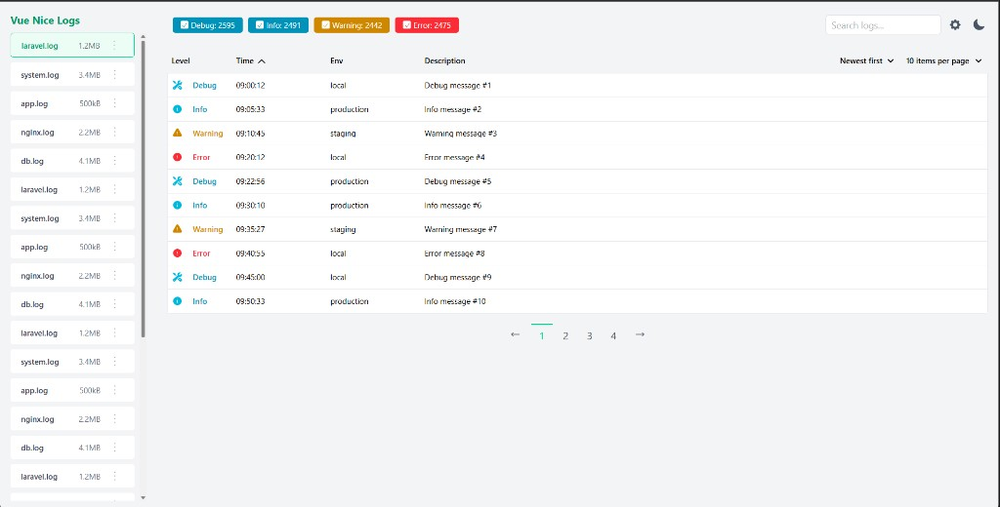

<div align="center">
  <p>
    <h1>Adonis Log Viewer<br/>Easy-to-use log viewer for AdonisJS</h1>
  </p>
</div>

<p align="center">
  <a href="#features">Features</a> |
  <a href="#requirements">Requirements</a> |
  <a href="#installation">Installation</a> |
  <a href="#usage">Usage</a> |
  <a href="#configuration">Configuration</a> |
  <a href="#integrating-into-your-adonis-app">Integrating</a> |
  <a href="#troubleshooting">Troubleshooting</a> |
  <a href="#contributing">Contributing</a>
</p>

<p align="center">
  <span><strong>AdonisJS 7.x</strong></span> ·
  <span><strong>Node.js ≥ 20.6</strong></span> ·
  <span><strong>npm ≥ 10</strong></span>
</p>

---



**Adonis Log Viewer** adds a browser UI to your **[AdonisJS](https://adonisjs.com/)** application so you can open, search, filter, and paginate logs without reading raw files on disk. The layout and flow are inspired by great Laravel tooling such as **[OPcodes Log Viewer](https://github.com/opcodesio/log-viewer)** ([README](https://github.com/opcodesio/log-viewer/blob/main/README.md)), adapted for Node and Adonis.

### Features

- Browse log files under your app’s **`logs/`** directory
- Search and sort log lines; paginate results
- Level-style filtering and counts where the viewer supports them
- JSON log lines mapped into table columns when possible
- **UI** served at **`/logs`** · **REST API** at **`/api/v1/logs`**

Official deep documentation for this repo may grow over time; for now this README is the source of truth for install and usage.

---

## Requirements

| Requirement | Supported version |
|-------------|-------------------|
| AdonisJS | **7.x** (this repo tracks `@adonisjs/core` **^7.3**) |
| Node.js | **20.6 or newer** (recommended: **current Active LTS**, e.g. **22.x**) |
| npm | **10 or newer** (ships with Node 20+); **pnpm/yarn** are fine if your team standardises on them |

These match typical AdonisJS 7 tooling. The repository root `package.json` lists an **`engines`** field so `npm install` can warn when your runtime is too old.

---

## Installation

There are two ways people use Adonis Log Viewer: **run the full project from Git** (demo / reference app), or **wire the viewer into an existing Adonis 7 application**. Pick one.

### A. Run this repository as the app

1. Clone:

   ```bash
   git clone https://github.com/<your-org>/vue-nice-logs.git
   cd vue-nice-logs
   ```

2. Install from the repo root:

   ```bash
   npm install
   ```

3. Configure the backend:

   ```bash
   cp app/backend/.env.example app/backend/.env
   cd app/backend
   node ace generate:key
   node ace migration:run
   cd ../..
   ```

4. Build this package (**UI + compiled provider**) and start the demo backend (see **[Usage](#usage)**).

### B. Install into an existing Adonis 7 app (npm package)

Adonis Log Viewer is an **npm package**: it bundles compiled server code (`dist/`), the built SPA (`resources/logs_viewer/`), and a **service provider** that registers **`/logs`** and **`/api/v1/logs`**. You do not copy controllers or routes into your app.

1. **Add the dependency** (examples):

   ```bash
   npm install vue-nice-logs
   ```

   ```bash
   npm install ../path/to/vue-nice-logs
   ```

   ```bash
   npm link vue-nice-logs
   ```

   For **`npm link`** or a **path install** of this monorepo, run **`npm install`** then **`npm run build`** inside **vue-nice-logs** first so **`dist/`** and **`resources/logs_viewer/`** exist (the linked folder must look like what gets published). In this repository, the demo app pins the package with **`file:../..`** in **`app/backend/package.json`**.

2. **Register the provider** in **`adonisrc.ts`** alongside your other providers:

   ```ts
   () => import('vue-nice-logs/provider'),
   ```

3. **CORS** — If the UI is loaded from another origin, allow it in **`config/cors.ts`** (this demo includes **`CORS_ORIGIN`** in **`.env.example`**).

Restart your server and open **`{APP_URL}/logs`**.

**Peers:** **`@adonisjs/core`** **^7.3** is already required by Adonis apps. **`mime-types`** is a dependency of **vue-nice-logs**; you do **not** add it separately.

---

## Usage

### Production-style (built UI)

From the **repository root**:

```bash
npm run build
```

This writes the SPA to **`resources/logs_viewer/`** and emits the package entry under **`dist/`**.

Then build and run the demo backend:

```bash
cd app/backend
node ace build
npm start
```

Open **`http://<HOST>:<PORT>/logs`** (defaults are often `localhost` and `3333` — see **`app/backend/.env`**).

### Local development (Vite HMR)

**Terminal 1**

```bash
npm run dev:backend
```

**Terminal 2**

```bash
npm run dev:frontend
```

In development, the HTML shell at `/logs` loads scripts from the Vite dev server (see **Configuration**).

---

## Configuration

| Variable | Where | Purpose |
|----------|--------|---------|
| `HOST`, `PORT` | `app/backend/.env` | URL of your Adonis server |
| `APP_KEY` | `app/backend/.env` | Required Adonis secret; run `node ace generate:key` |
| `LOGS_VITE_ORIGIN` | process env (Adonis) | Dev only; default `http://localhost:5173` |
| `LOGS_VITE_BASE` | process env (Adonis) | Dev only; default `/logs/assets` (must match Vite `base`) |
| `CORS_ORIGIN` | optional in `.env` | Comma-separated origins if you call the API from another host |

Log files are read from **`logs/`** at the Adonis application root (`app.makePath('logs')`).

---

## Integrating into your Adonis app

After **`npm install vue-nice-logs`**:

1. Add **`() => import('vue-nice-logs/provider')`** to **`providers`** in **`adonisrc.ts`**.
2. **`files` published with the package:** route registration is handled by **`VueNiceLogsProvider`** (**`start`** hook → **`Router`**).

If you fork and change **`/logs`**, update **`base`** in **`app/frontend/vite.config.js`**, **`npm run build`** at repo root (so **`resources/logs_viewer/`** and matching URLs stay aligned), and adjust the prefixes in **`src/providers/vue_nice_logs_provider.ts`** before **`npm publish`** / linking.

---

## Troubleshooting

### Logs not appearing

- Confirm files exist under **`logs/`** at your Adonis app root and the Node process **can read** them.
- Plaintext and JSON lines are supported in different ways (JSON tries to populate columns).

### Blank page at `/logs` in production

- Ensure **`node_modules/vue-nice-logs/resources/logs_viewer/app.js`** and **`app.css`** exist (included in the published tarball).
- **`npm link` / folder install**: run **`npm run build`** in **vue-nice-logs** so those files are generated locally.
- Check the browser network tab for 404s on **`/logs/assets/...`**.

### Dev mode can’t load Vite scripts

- Start **`npm run dev:frontend`** and ensure **`LOGS_VITE_ORIGIN`** matches the Vite URL.
- Firewall or Docker: expose **5173** if the browser loads the app from another host.

---

## Contributing

Please see **[CONTRIBUTING.md](CONTRIBUTING.md)** — structured like **[OPcodes Log Viewer CONTRIBUTING](https://github.com/opcodesio/log-viewer/blob/main/CONTRIBUTING.md)** but for npm, Vue, and Adonis.

---

## Credits

- Inspired by **[opcodesio/log-viewer](https://github.com/opcodesio/log-viewer)** ([README](https://github.com/opcodesio/log-viewer/blob/main/README.md))

## License

The MIT License — see **[LICENSE](LICENSE)**.
